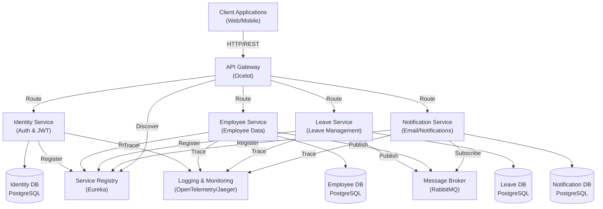
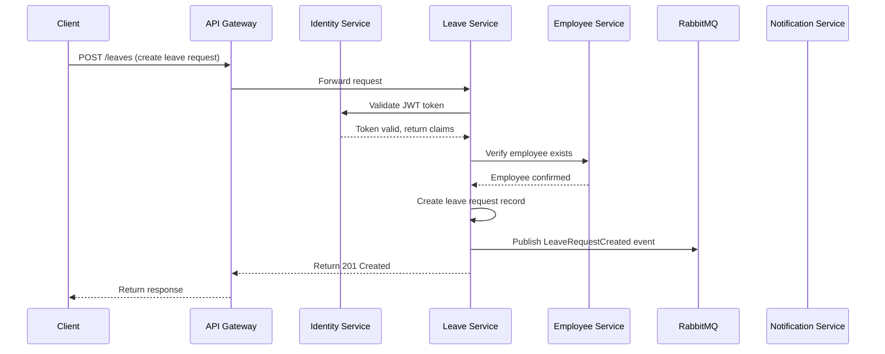
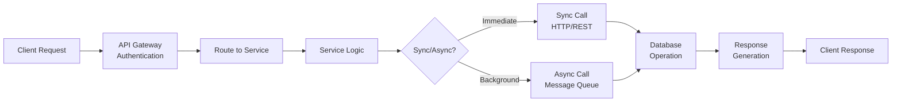
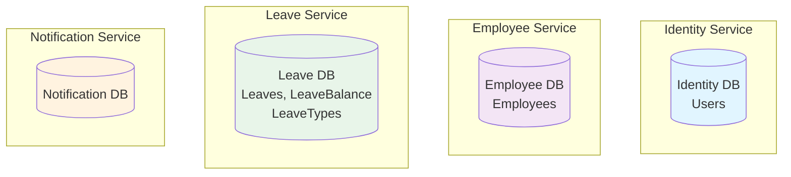
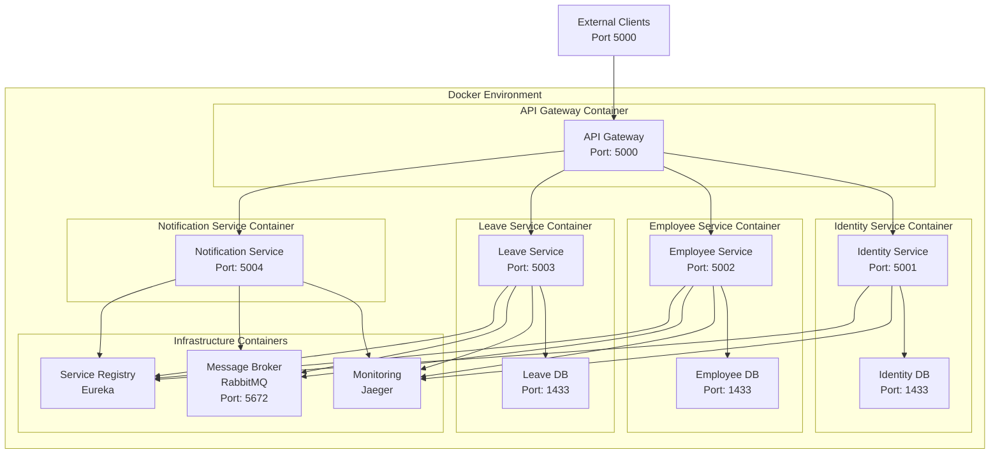
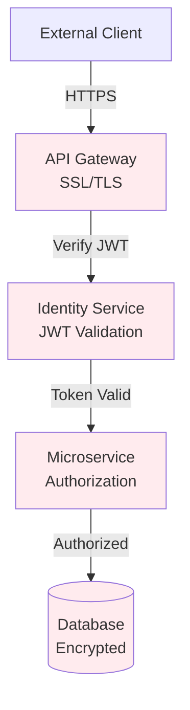
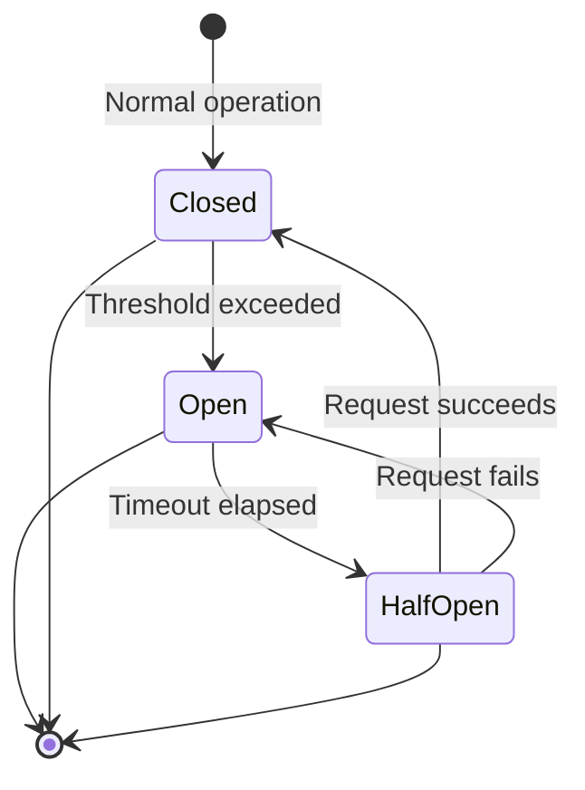

# Microservices Design Document

## Executive Summary
The Leave Management System (LMS) is built on a microservices architecture designed for scalability, maintainability, and independent deployment of services. This document outlines the architectural design, component interactions, and deployment strategy.

---

## 1. System Architecture Overview

### High-Level Architecture Diagram



---

## 2. Service Architecture

### 2.1 API Gateway Service

**Purpose**: Single entry point for all client requests; routing, load balancing, and authentication

**Technology Stack**:
- Framework: ASP.NET Core 8.0
- Gateway: Ocelot
- Service Discovery: Eureka

**Responsibilities**:
- Route requests to appropriate microservices
- Implement rate limiting and throttling
- Handle cross-cutting concerns (CORS, security headers)
- Service discovery and load balancing
- Request/response transformation

**Configuration Files**:
- `ocelot.eureka.json` - Service discovery configuration
- `ocelot.static.json` - Static routes fallback

**Key Endpoints**:
- Health check: `/health`
- Proxied requests: `/*` → routed to respective services

---

### 2.2 Identity Service

**Purpose**: Centralized authentication and authorization

**Technology Stack**:
- Framework: ASP.NET Core 8.0
- Authentication: JWT (JSON Web Tokens)
- Database: PostgreSQL

**Responsibilities**:
- User authentication (login)
- JWT token generation and validation
- Role-based access control (RBAC)
- User registration and profile management

**API Endpoints**:
- `POST /auth/login` - Authenticate user
- `GET /users` - Get user details

**Database Schema**:
- Users table

---

### 2.3 Employee Service

**Purpose**: Manage employee data and master records

**Technology Stack**:
- Framework: ASP.NET Core 8.0
- Database: PostgreSQL
- ORM: Entity Framework Core

**Responsibilities**:
- Employee CRUD operations
- Employee profile management
- Department and designation management
- Reporting structure
- Employee status tracking

**API Endpoints**:
- `GET /employees/team` - List all employees
- `POST /employees` - Create new employee
- `Get /employees/{userid}/leave-balances` - Get leave balance

**Database Schema**:
- Employees table

**Events Published**:
- EmployeeCreated

---

### 2.4 Leave Service

**Purpose**: Core business logic for leave management

**Technology Stack**:
- Framework: ASP.NET Core 8.0
- Database: PostgreSQL
- ORM: Entity Framework Core

**Responsibilities**:
- Leave request submission
- Leave approval/rejection/cancelltion workflow
- Leave balance management
- Leave history tracking

**API Endpoints**:
- `GET /leaves/manager/requests` - List pendings leave requests
- `GET /leaves/history` - Get leave history
- `POST /leaves/apply` - Submit leave request
- `PUT /leaves/{id}/approve` - Approve leave
- `PUT /leaves/{id}/reject` - Reject leave
- `PUT /leaves/{id}/cancel` - cancel leave
- `GET /leaves/circuit-breaker/test/{input}` - Test circuit breaker

**Database Schema**:
- LeaveRequest table

**Dependencies**:
- Identity Service (validate user)
- Employee Service (validate employee, check approval hierarchy)

**Events Published**:
- LeaveRequestCreated
- LeaveApproved
- LeaveRejected
- LeaveCancelled

---

### 2.5 Notification Service

**Purpose**: Handle all notification delivery

**Technology Stack**:
- Framework: ASP.NET Core 8.0
- Message Queue: RabbitMQ (Consumer)
- Email Service: SMTP

**Responsibilities**:
- Send notifications
- Format notification templates
- Retry failed notifications

**Message Subscriptions**:
- LeaveRequestCreated → Send confirmation 
- LeaveApproved → Send approval notification
- LeaveRejected → Send rejection notification
- LeaveCancelled → Send cancel notification


---

## 3. Technology Stack

### Backend
- **Runtime**: .NET 8.0
- **Language**: C#
- **Framework**: ASP.NET Core

### Databases
- **Primary**: PostgreSQL
- **Type**: Relational databases per service (Database-per-service pattern)

### Communication
- **Synchronous**: HTTP/REST
- **Asynchronous**: RabbitMQ (Message Queue)

### Service Discovery & Registry
- **Tool**: Netflix Eureka
- **Client**: Steeltoe

### API Gateway
- **Gateway**: Ocelot

### Monitoring & Observability
- **Distributed Tracing**: Jaeger
- **Metrics & Tracing**: OpenTelemetry
- **Correlation ID**: Custom middleware

### Containerization & Orchestration
- **Container**: Docker
- **Orchestration**: Docker Compose
- **Registry**: Docker Hub/Local registry

---

## 4. Detailed Service Interaction Diagram



---

## 5. Data Flow Architecture



---

## 6. Database Architecture (Database-per-Service)



**Rationale**:
- Loose coupling between services
- Independent scaling and optimization
- Flexibility in technology choices per service
- Service autonomy

---

## 7. Deployment Architecture



---

## 8. Request Flow Example: Leave Submission

```
1. CLIENT SENDS REQUEST
   POST /api/leaves HTTP/1.1
   Authorization: Bearer <JWT_TOKEN>
   Content-Type: application/json
   X-Correlation-ID: <UUID>
   {
     "startDate": "2024-06-01",
     "endDate": "2024-06-05",
     "leaveType": "Casual",
     "reason": "Personal reasons"
   }

2. API GATEWAY
   - Extracts correlation ID (or generates new)
   - Routes to Leave Service based on path
   - Adds X-Correlation-ID header

3. LEAVE SERVICE
   - Middleware adds correlation ID to logs
   - Validates JWT token with Identity Service
   - Checks employee existence with Employee Service
   - Validates leave policy and balance
   - Creates leave request record in database

4. MESSAGE PUBLISHING
   - Publishes "LeaveRequestCreated" event to RabbitMQ
   - Event contains: LeaveID, EmployeeID, Dates, etc.

5. NOTIFICATION SERVICE
   - Consumes "LeaveRequestCreated" event
   - Renders email template
   - Sends notification email to employee
   - Publishes "NotificationSent" event

6. RESPONSE TO CLIENT
   {
     "leaveId": "guid",
     "status": "Pending",
     "submittedDate": "2024-05-30T10:30:00Z"
   }
```

---

## 9. Scalability Considerations

### Horizontal Scaling
- **Stateless Services**: Each service instance is independent
- **Load Balancing**: API Gateway distributes requests
- **Database**: Can be scaled separately per service
- **Message Queue**: RabbitMQ handles peak loads with consumer groups

### Caching Strategy
- **Service-level caching**: Configuration, reference data
- **Database caching**: Query result caching where applicable
- **API Gateway caching**: Cache frequently accessed resources

### Performance Optimization
- Connection pooling for database connections
- Async/await patterns for non-blocking operations
- Message batching for bulk operations
- Index optimization on frequently queried fields

---

## 10. Security Architecture



**Security Layers**:
1. **Transport**: HTTPS/TLS between client and gateway
2. **Authentication**: JWT tokens validated by Identity Service
3. **Authorization**: Role-based access control (RBAC)
4. **Data**: Database encryption at rest
5. **Network**: Internal Docker network for service-to-service communication

---

## 11. Error Handling & Resilience

### Circuit Breaker Pattern


### Retry Strategy
- **Transient Failures**: Retry with exponential backoff
- **Max Retries**: 3 attempts
- **Backoff Period**: 1s, 2s, 4s
- **Non-transient**: Fail immediately

### Fallback Mechanisms
- Return cached data if available
- Default responses for non-critical operations
- Graceful degradation of functionality

---

## 12. Monitoring & Observability

### Key Metrics
- **Service Health**: Response time, error rate, throughput
- **Database**: Query performance, connection pool utilization
- **Queue**: Message lag, consumer lag, throughput
- **Business**: Leave requests submitted, approval rate, average processing time

### Distributed Tracing
- **Tool**: Jaeger + OpenTelemetry
- **Correlation ID**: Tracks requests across services
- **Span Tracking**: Individual operation timing

### Health Checks
- **Endpoint**: `/health` on each service
- **Checks**: Database connectivity, queue connectivity, dependencies
- **Frequency**: Every 10 seconds

---

## 13. Development & Deployment

### Local Development
```bash
# Start all services
docker-compose up

# Individual service debugging
dotnet run --project src/Services/LeaveService/LeaveService.csproj
```

### CI/CD Pipeline
1. Build & Compile
2. Unit Tests
3. Integration Tests
4. Build Docker Images
5. Push to Registry
6. Deploy to Staging
7. Integration Tests
8. Deploy to Production

### Versioning Strategy
- **API Version**: URL path versioning (`/api/leaves`)
- **Database**: Migration-based versioning
- **Service**: Semantic versioning (MAJOR.MINOR.PATCH)

---

## 15. Glossary

| Term | Definition |
|------|-----------|
| Microservice | Independent, loosely-coupled service |
| API Gateway | Central entry point for client requests |
| Service Discovery | Dynamic registration and discovery of services |
| Circuit Breaker | Pattern to prevent cascading failures |
| Correlation ID | Unique identifier for request tracing |
| JWT | JSON Web Token for stateless authentication |
| RabbitMQ | Message broker for async communication |
| Eureka | Service registry for dynamic service discovery |
| OpenTelemetry | Framework for distributed tracing and metrics |
| Jaeger | Backend for storing and visualizing distributed traces |

---

## Document Control

| Version | Date | Author | Changes |
|---------|------|--------|---------|
| 1.0 | 2024-05-30 | Architecture Team | Initial document |

---

